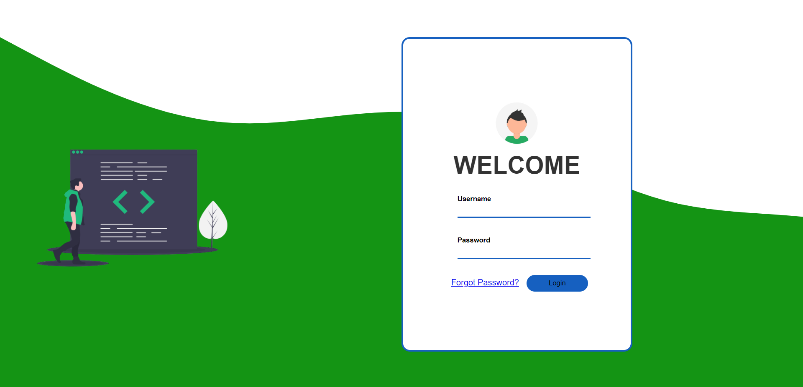
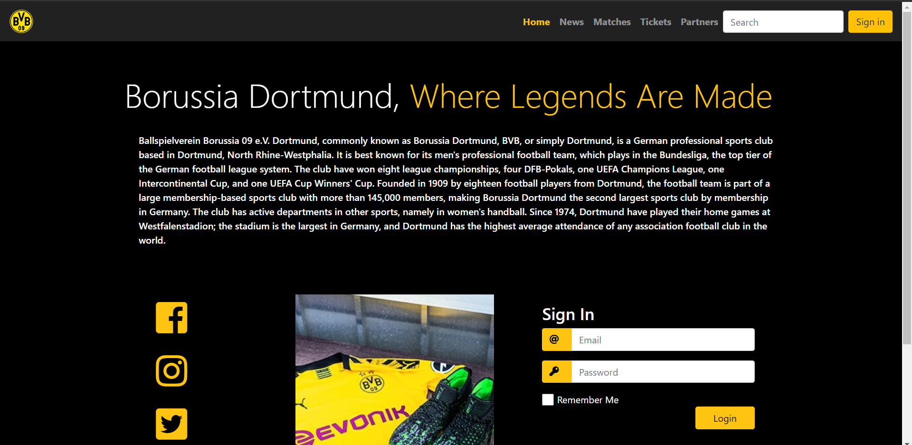
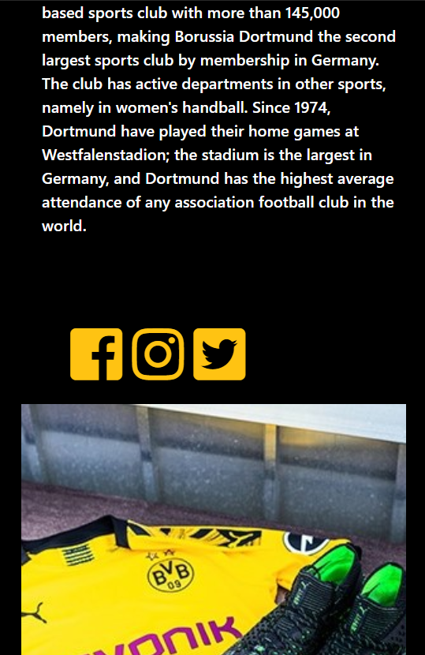
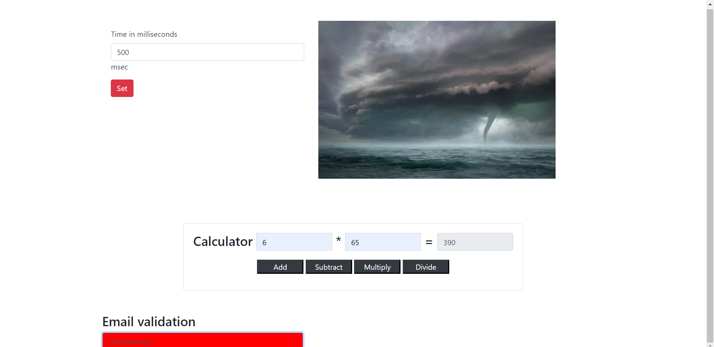
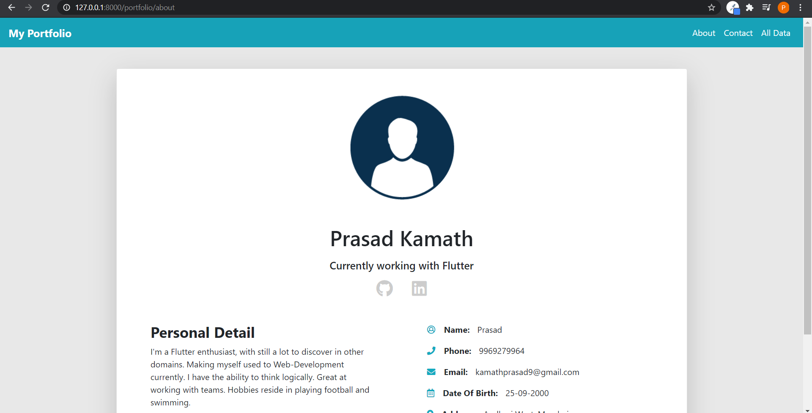
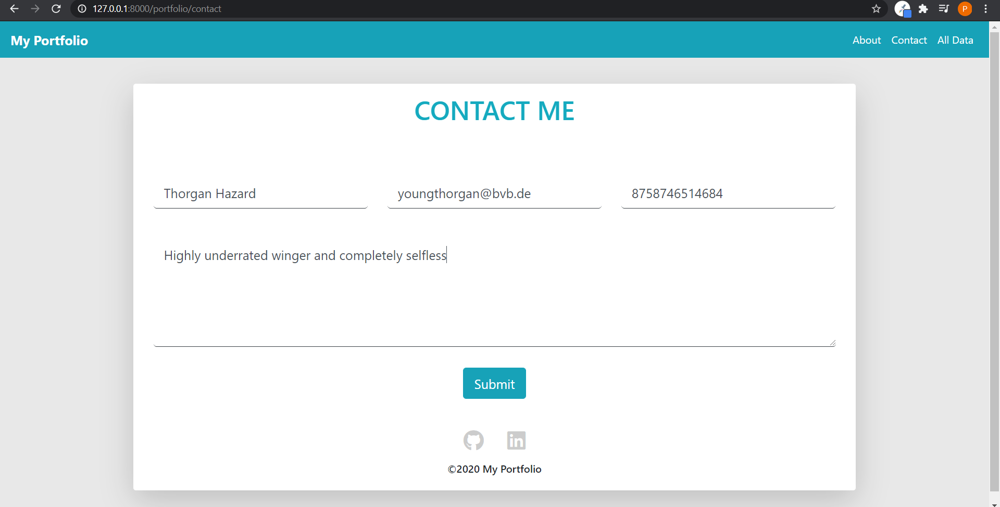
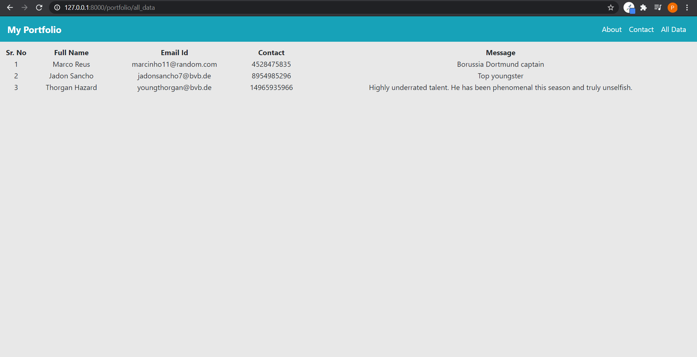
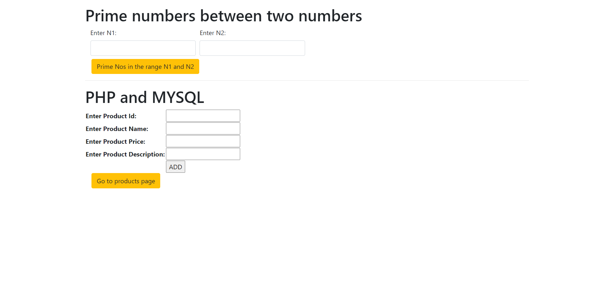
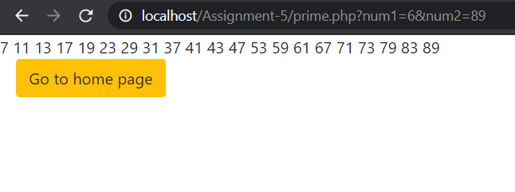
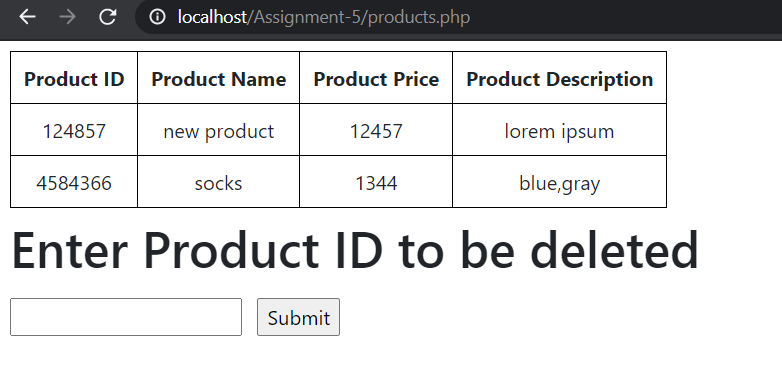

# sem5-web-dev-workshop

## Assignment 1.2 
Html and CSS: https://kamathprasad9.github.io/sem5-web-dev-workshop/1.2_html_css/index.html

## Assignment 2 
Bootstrap: https://kamathprasad9.github.io/sem5-web-dev-workshop/2_Bootstrap/index.html

## Assignment 3
Bootstrap: https://kamathprasad9.github.io/sem5-web-dev-workshop/3_Javascript/index.html

## Assignment 4
Django: 

 

## Assignment 5
PHP and MySQL:

